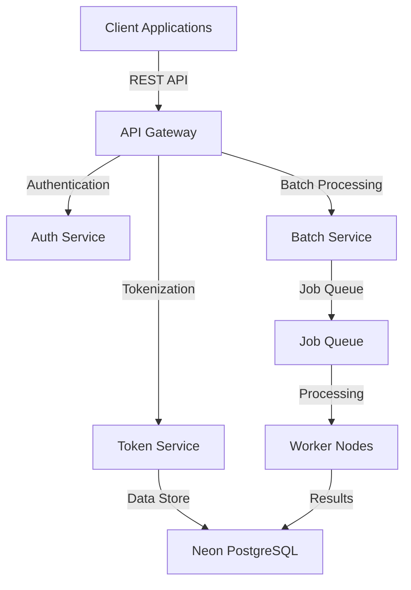
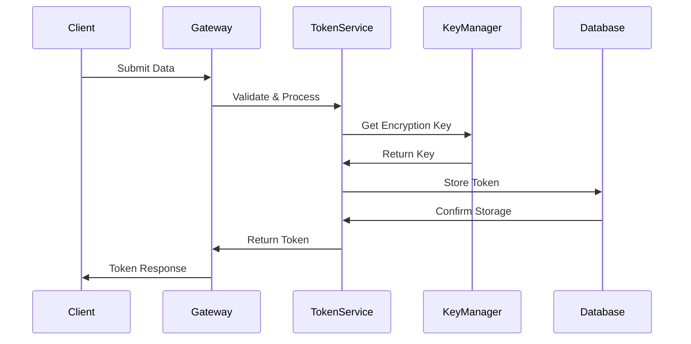
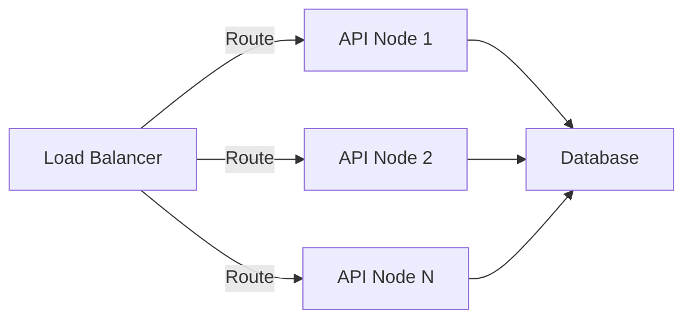
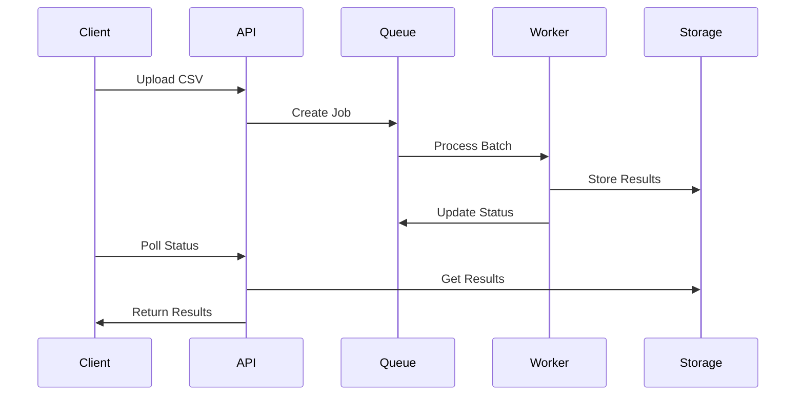
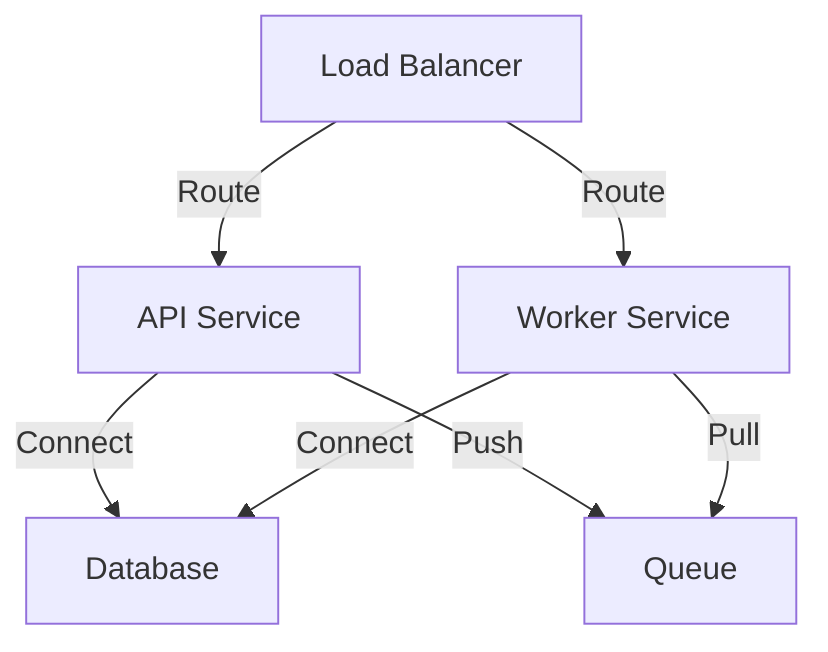

# System Architecture

## Overview

The Tokenization Platform is designed as a modern, scalable solution for secure data protection. It employs a vaultless tokenization approach, ensuring sensitive data never persists in its original form while maintaining data utility.

## System Components



### Key Components

1. **API Gateway**
   - Rate limiting
   - Request validation
   - Load balancing

2. **Auth Service**
   - API key management
   - User authentication
   - Permission control

3. **Token Service**
   - Tokenization logic
   - Key management
   - Token validation

4. **Batch Service**
   - CSV processing
   - Job management
   - Result aggregation

5. **Database**
   - Token storage
   - User management
   - Audit logging

## Security Architecture

### Data Flow


### Security Measures

1. **Encryption**
   - AES-256 for data encryption
   - RSA for key exchange
   - Secure key rotation

2. **Authentication**
   - Multi-factor authentication
   - API key management
   - Session handling

3. **Authorization**
   - Role-based access control
   - Resource-level permissions
   - Audit logging

## Scalability

### Horizontal Scaling


### Performance Optimizations

1. **Caching**
   - Token cache
   - Session cache
   - Results cache

2. **Connection Pooling**
   - Database connections
   - Worker connections
   - API connections

## Data Models

### Core Entities

```typescript
interface Token {
  id: string;
  value: string;
  metadata: Record<string, unknown>;
  created_at: Date;
  expires_at?: Date;
  version: number;
}

interface User {
  id: string;
  username: string;
  roles: string[];
  api_keys: ApiKey[];
}

interface AuditLog {
  id: string;
  action: string;
  user_id: string;
  resource_id: string;
  timestamp: Date;
  metadata: Record<string, unknown>;
}
```

## Integration Patterns

### API Integration
```typescript
// Client SDK Example
class TokenizationClient {
  constructor(apiKey: string) {
    this.apiKey = apiKey;
  }

  async tokenize(data: string): Promise<string> {
    // Implementation
  }

  async detokenize(token: string): Promise<string> {
    // Implementation
  }
}
```

### Batch Processing


## Monitoring & Observability

### Metrics Collection

1. **System Metrics**
   - CPU usage
   - Memory usage
   - Disk I/O
   - Network traffic

2. **Application Metrics**
   - Request rate
   - Error rate
   - Response time
   - Queue length

3. **Business Metrics**
   - Tokens created
   - Batch jobs processed
   - Active users
   - API key usage

### Logging

1. **Application Logs**
   - Error logs
   - Access logs
   - Debug logs
   - Performance logs

2. **Audit Logs**
   - User actions
   - System changes
   - Security events
   - Data access

## Deployment Architecture

### Container Orchestration


### High Availability

1. **Database**
   - Primary-replica setup
   - Automated failover
   - Backup strategy

2. **Application**
   - Multiple instances
   - Auto-scaling
   - Health checks

## Future Enhancements

1. **Features**
   - Advanced analytics
   - Custom tokenization schemes
   - Enhanced reporting

2. **Technical**
   - GraphQL API
   - Real-time updates
   - Enhanced monitoring

3. **Security**
   - Hardware security modules
   - Enhanced encryption
   - Advanced threat detection
